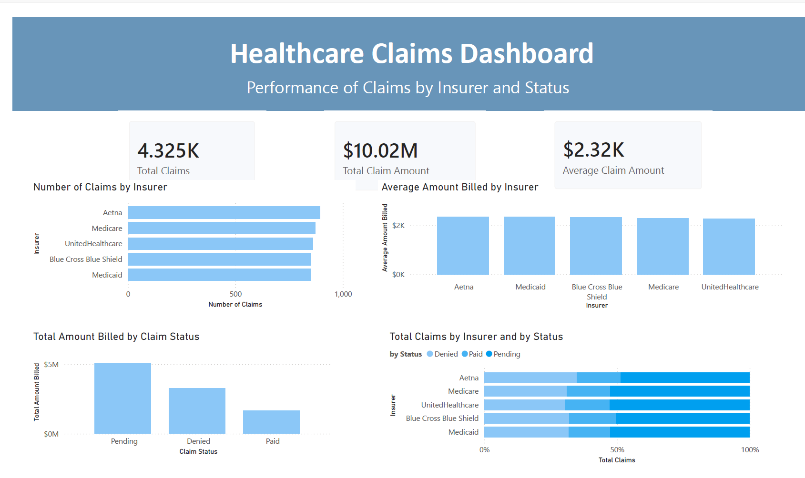

# Healthcare Claims Power BI Dashboard
This Power BI project analyzes healthcare claims data to provide insights into claim volume, billed amounts, insurer performance, and claim status trends. The dashboard was designed to support data-driven decision-making through clear KPI tracking and visual analysis.
## Project Objectives
- Analyze total claim volume and billed amounts
- Compare claim activity across insurers
- Evaluate claim status trends such as Paid, Pending, and Denied
- Build an interactive dashboard for quick business insights
## Tools Used
- Power BI
- Data Cleaning and Transformation
- Data Visualization
- Power Query
## Dataset Overview
The dataset includes healthcare claims records with fields related to:
- Claim number
- Insurer
- Amount billed
- Claim state
- Claim status
- Submission date
- Resubmission flag
## Data Preparation
The following transformations were completed in Power BI:
- Imported the claims table
- Renamed the source table to `Claims`
- Renamed columns for readability
- Changed claim and encounter identifiers to text format
- Formatted date fields as short dates
- Formatted billed amount as currency with two decimal places
## Dashboard Pages
#### 1. Claims Overview
This page includes high-level KPIs and summary visuals, such as:
- Total number of claims
- Total claim amount
- Average claim amount
- Number of claims by insurer
- Average billed amount by insurer
- Total billed amount by claim status
- Total claims by insurer and claim status
#### 2. Claims Breakdown
This page is reserved for additional drill-down analysis and supporting visuals.
## Key Features
- KPI cards for total claims, total billed amount, and average claim amount
- Insurer comparison visualizations
- Claim status breakdown
## Key Insight
One notable insight from the dashboard is that pending claims represented the highest billed total, which may suggest delays in reimbursement or claims processing.
## Dashboard Screenshots
### Claims Overview

## Business Value
This dashboard helps stakeholders monitor claim activity, identify insurer trends, and track claim outcomes more efficiently. It supports faster review of financial and operational patterns within healthcare claims data.
## Author
Ashley Odom

Aspiring Healthcare Data Analyst with a background in behavioral health, UX, and data visualization.
